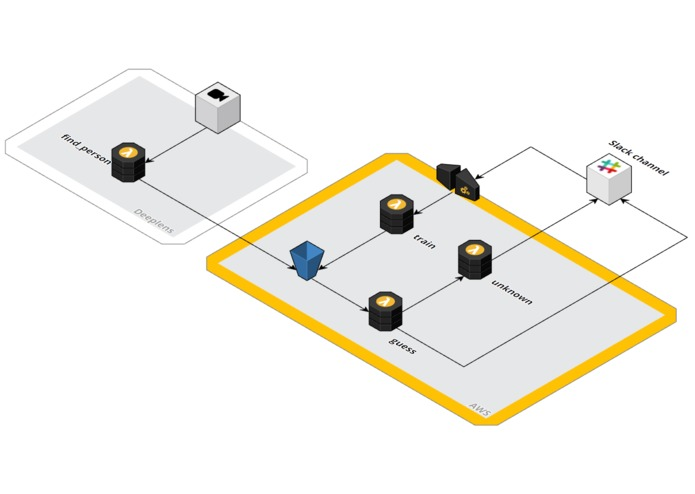

# Mechanical Rock - Virtual Concierge

This will greet your coworkers on slack when they enter the office.

## Setup

Make a copy of `env.yml.sample` to `env.yml` and edit the four variables based on the following steps

### Rekognition Collection

```bash
aws rekognition create-collection --collection-id "vc-collection"
```

- Set `REKOGNITION_COLLECTION_ID` in `env.yml` based on the collection ID used above

### Deploy Serverless App

```bash
serverless deploy
```

- Get the output gateway endpoint field (will look like the following), you will use it in the next step

```bash
endpoints:
  POST - https://XXXXXXXXX.execute-api.us-east-1.amazonaws.com/dev/faces/train
```

### Slack App

- Go to the [slack api](https://api.slack.com/apps), and click "create a new app".
- Give a name, and select your workspace


- Incoming webhooks
- Interactive components (use the api gateway endpoint that you noted before, ignore `Load URL`)


- Permissions: Install the app in your workspace, and note the token. You'll need `chat:write:bot`, `channels:read` and `incoming-webhook`.


- Copy this OAuth code into the `SLACK_API_TOKEN` field in `env.yml`.


#### Re-deploy Serverless App

Now that all the fields in the env.yml file are setup, re-deploy the serverless app

```bash
serverless deploy
```

### DeepLens Setup

- Go into the deeplens console, and create a project, select the "Object detection" model
- Remove the `deeplens-object-detection` function, and add the function for `find_person`


- Deploy the application to your deeplens

That should be it. Whenever the Deeplens rekognizes someone, it will upload into the S3 bucket. Which will trigger the other lambda functions.

## Architecture



## Known Issues

### AWS Profile

When deploying with Serverless using MFA and alternative profiles you'll need to set the credentials as environment variables yourself

```bash
response=$(aws sts assume-role --role-arn arn:aws:iam::12345678910:role/DevOpsRole --role-session-name "Serverless" --profile sandbox)
# Set Variables
export AWS_ACCESS_KEY_ID=$(echo $response | jq -r '.Credentials.AccessKeyId')
export AWS_SECRET_ACCESS_KEY=$(echo $response | jq -r '.Credentials.SecretAccessKey')
export AWS_SESSION_TOKEN=$(echo ${response} | jq -r '.Credentials.SessionToken')
```

### DeepLens is Flakey

Issues with DeepLens running the person detection code

## Attribution

- [This was send in as part of the AWS Deeplens Hackaton](https://devpost.com/software/doorman-a1oh0e)
