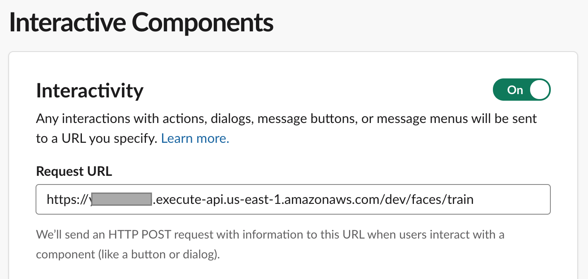
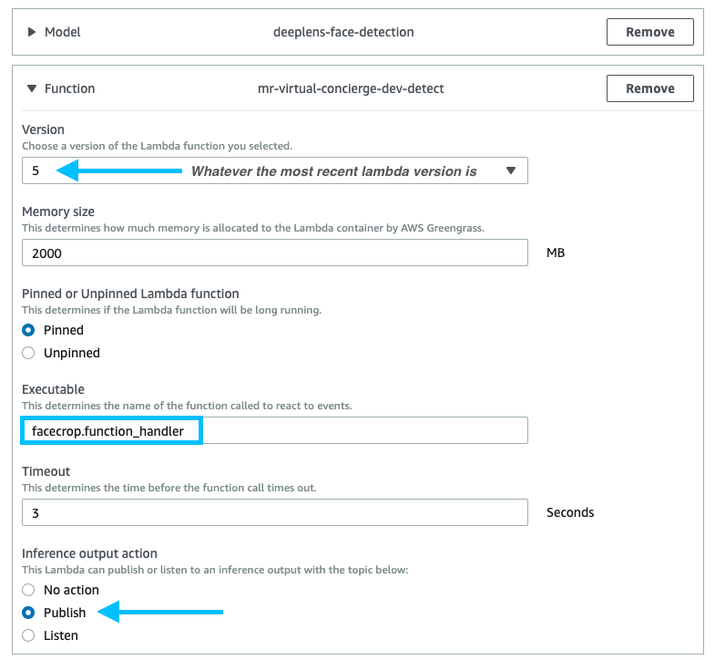

# Mechanical Rock - Virtual Concierge

This will greet your coworkers on slack when they enter the office.

## Setup

Make a copy of `env.yml.sample` to `env.yml` and edit the four variables based on the following steps

### Rekognition Collection

```bash
aws rekognition create-collection --collection-id "vc-collection"
```

- Set `REKOGNITION_COLLECTION_ID` in `env.yml` based on the collection ID used above

### Deploy Serverless App

```bash
serverless deploy
```

- Get the output gateway endpoint field (will look like the following), you will use it in the next step

```bash
endpoints:
  POST - https://XXXXXXXXX.execute-api.us-east-1.amazonaws.com/dev/faces/train
```

### Slack App

- Go to the [Slack API](https://api.slack.com/apps), and click "create a new app".
- Give a name, and select your workspace


- Enable Incoming webhooks

- Copy this OAuth code into the `SLACK_API_TOKEN` field in `env.yml`.


- Permissions: Install the app in your workspace, and note the token. You'll need `channels:read`, `chat:write`, `chat:write:customize`, `incoming-webhook`, `users:read` and `users:write`.


- Interactive components (use the api gateway endpoint that you noted before, ignore `Load URL`)



- Use [Slack API conversations.list](https://https://api.slack.com/methods/conversations.list) to determine the channel id. Copy this id into the `SLACK_CHANNEL_ID` field in `env.yml`


### Re-deploy Serverless App

Now that all the fields in the env.yml file are setup, re-deploy the serverless app

```bash
serverless deploy
```

### DeepLens Setup

- Go into the deeplens console, and create a project, select the "Object detection" model
- Remove the `deeplens-face-detection` function, and add the function for `facecrop.function_handler`

**NOTE**: Jump down to the _DeepLens is Flakey_ section of this guide for more details around deploying the SAM alternative of the detect function

- take the Deeplens ID from the Device console and place it in `IOT_TOPIC` in `env.yml`



- Deploy the application to your deeplens

That should be it. Whenever the Deeplens rekognizes someone, it will upload into the S3 bucket. Which will trigger the other lambda functions.

## Architecture


## Known Issues

### AWS Profile

When deploying with Serverless using MFA and alternative profiles you'll need to set the credentials as environment variables yourself

```bash
response=$(aws sts assume-role --role-arn arn:aws:iam::676416293960:role/DevOpsRole --role-session-name "Serverless" --profile mr-sandbox-vc)
# Set Variables
export AWS_ACCESS_KEY_ID=$(echo $response | jq -r '.Credentials.AccessKeyId')
export AWS_SECRET_ACCESS_KEY=$(echo $response | jq -r '.Credentials.SecretAccessKey')
export AWS_SESSION_TOKEN=$(echo ${response} | jq -r '.Credentials.SessionToken')
```

### DeepLens is Flakey

Issues with DeepLens running the person detection code. I would like to be able to deploy it in the serverless.yaml config under the following

```yaml
  detect:
    runtime: python2.7
    timeout: 3
    memorySize: 1536
    handler: deeplens/facecrop.function_handler
```

I'm working towards this however in the meantime the following deployment method might be better

```bash
aws s3 mb s3://mr-virtual-concierge-sam-dev

aws cloudformation package \
  --template-file template.yaml \
  --output-template-file template-out.yaml \
  --s3-bucket mr-virtual-concierge-sam-dev

aws cloudformation deploy \
  --template-file template-out.yaml \
  --stack-name "mr-virtual-concierge-dev-sam"  \
  --capabilities CAPABILITY_IAM
```

Add lifecycle policy to the VC bucket:

```
aws s3api put-bucket-lifecycle-configuration --profile mrvirtual2 --region us-east-1 --bucket virtual-concierge-dev --lifecycle-configuration  file://lifecycle.json
```

## Attribution

- [This was send in as part of the AWS Deeplens Hackaton](https://devpost.com/software/doorman-a1oh0e)
